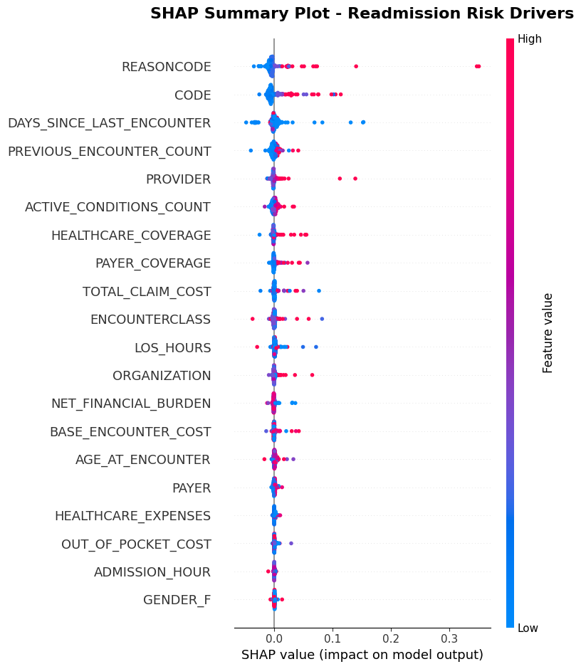

  

# Mapping the Operational Bottlenecks of Hospital Readmissions

> **An integrated pipeline combining Machine Learning, Explainable AI (XAI), and Process Mining to uncover the bottlenecks driving 30-day hospital readmissions.**

## 📖 About the Project
Hospital readmissions impose a heavy burden on healthcare systems. This project reconstructs and analyzes the full patient journey from admission to discharge to identify operational bottlenecks. By integrating **Random Forest classification**, **SHAP (SHapley Additive exPlanations)**, and **Process Mining**, we stratify patients into risk cohorts to visually and quantitatively compare their care pathways.

For a comprehensive breakdown of our methodology, distributed computing architecture, and clinical findings, please refer to the full research paper:
📄 **[Read the Full Paper (PDF)](Paper.pdf)**

## 📊 Key Visualizations & Findings

### XAI-Driven Risk Stratification
We utilized SHAP to assess feature importance and identify the primary predictors of readmission risk. This enabled the extraction of a mathematical threshold to actively filter and stratify patient event logs.

### Process Mining: Care Pathway Comparisons
By splitting the data based on our XAI threshold, we generated Directly-Follows Graphs (DFGs) to observe how different cohorts navigate the hospital system. The comparison uncovers a dual bottleneck for high-risk patients: rapid acute care recycling and prolonged delays in transitional care.

#### High-Risk Patient Pathway
*High-risk patients navigate more complex care pathways and frequently get stuck in readmission rework loops.*

#### Low-Risk Patient Pathway
*The low-risk cohort serves as an empirical baseline for an optimal care pathway, primarily cycling through preventive and wellness-oriented care.*

---
*Built with PM4Py, Scikit-Learn, Optuna, and PySpark.*
